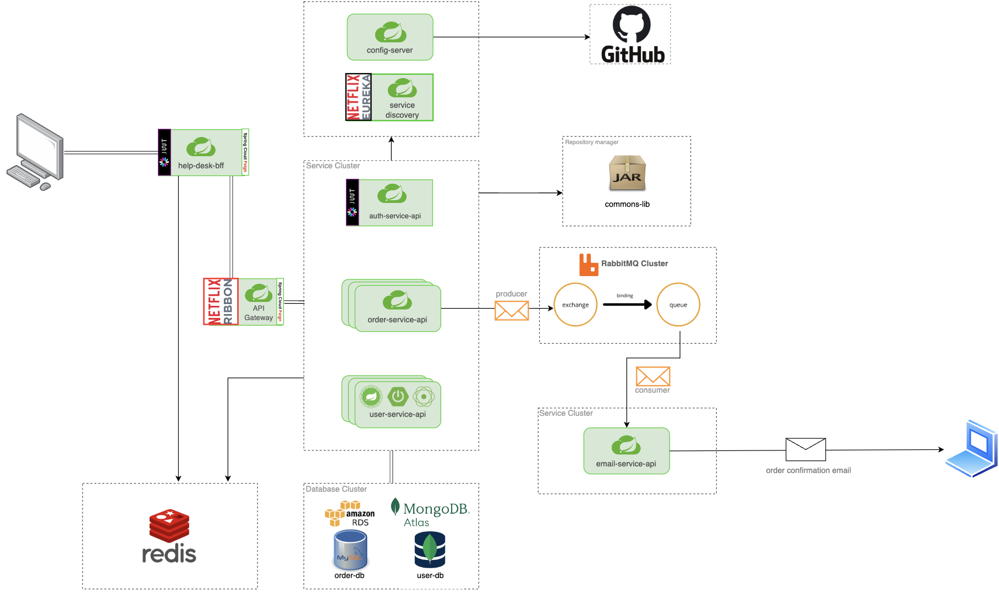

# Help Desk Microservices 🚀

Este repositório contém a infraestrutura e os microsserviços do sistema **Help Desk / Expert Bank Backend**. A arquitetura foi desenvolvida utilizando **Spring Boot 3.x**, **Spring Cloud** (Eureka, Gateway, Config Server), **RabbitMQ** para comunicação assíncrona, **Redis** para caching, **MongoDB** para dados de usuários/autenticação e **PostgreSQL** para gerenciamento de ordens de serviço.

---

## 📌 Projetos e Componentes

O projeto é dividido em múltiplos módulos de microsserviços e uma biblioteca compartilhada:

### 1. ⚙️ Serviços de Infraestrutura
*   **`service-discovery` (Eureka Server)** [Porta `8761`]: Servidor de registro e descoberta de serviços. Permite que os microsserviços se localizem dinamicamente sem necessidade de IPs/portas estáticos no código.
*   **`config-server` (Spring Cloud Config Server)** [Porta `8888`]: Servidor de configuração centralizado. Ele carrega as configurações dos microsserviços diretamente de um repositório Git público (`https://github.com/rivaldoDeveloper/backend-expert-configs`).
*   **`api-gateway` (Spring Cloud Gateway)** [Porta `8765`]: Ponto de entrada único (API Gateway) que roteia dinamicamente as requisições externas para os microsserviços correspondentes baseando-se no registro do Eureka.

### 2. 🏛️ Microsserviços Funcionais
*   **`auth-service-api`** [Porta `8082`]: Responsável pela autenticação de usuários, geração de tokens JWT e controle de expiração de *Refresh Tokens*. Utiliza o **MongoDB** para persistir os tokens de atualização.
*   **`user-service-api`** [Porta `8088`]: Microsserviço responsável pela gestão e cadastro de usuários e perfis de acesso. Utiliza **MongoDB** como banco de dados principal.
*   **`order-service-api`** [Porta `8100`]: Microsserviço responsável pela criação, atualização, listagem e remoção de ordens de serviço. Utiliza o **PostgreSQL** como banco de dados relacional. Ao criar uma ordem, ele valida o cliente/solicitante no `user-service-api` (via *OpenFeign*) e dispara um evento assíncrono para o **RabbitMQ** notificando a criação.
*   **`email-service`** [Porta `9090`]: Consome mensagens assíncronas do **RabbitMQ** (fila `queue.orders`) e envia notificações de e-mail em formato HTML sobre a criação das ordens de serviço utilizando protocolo SMTP (Gmail configurado por padrão).

### 3. 🌐 Camada BFF & Biblioteca Comum
*   **`helpdesk-bff` (Backend for Frontend)** [Porta `8080`]: Atua como um orquestrador ou agregador projetado para simplificar as chamadas do cliente frontend. Possui filtros de segurança com **Spring Security** para validação de JWT e integra com o **Redis** para caching de alta performance. Comunica-se com os demais microsserviços internos via *OpenFeign*.
*   **`hd-commons-lib`** (Biblioteca Maven): Biblioteca compartilhada com classes utilitárias, enums (`OrderStatusEnum`, `ProfileEnum`), DTOs de comunicação (ex: `OrderCreatedMessage`), e exceções customizadas. É importada como dependência direta em todos os microsserviços Gradle do projeto.

---

## 📐 Desenho da Arquitetura

O diagrama abaixo ilustra o fluxo de requisições, descoberta de serviços, leitura de configurações e a comunicação assíncrona/síncrona entre os microsserviços:

```mermaid
graph TD
    Client["Client / Frontend"] -->|Chamadas via BFF (Port 8080)| BFF["helpdesk-bff (Port 8080)"]
    Client -->|Rotas do Gateway (Port 8765)| Gateway["api-gateway (Port 8765)"]
    
    subgraph Core Services
        BFF -->|OpenFeign| Auth["auth-service-api (Port 8082)"]
        BFF -->|OpenFeign| User["user-service-api (Port 8088)"]
        BFF -->|OpenFeign| Order["order-service-api (Port 8100)"]
        
        Gateway -->|Roteamento Eureka| Auth
        Gateway -->|Roteamento Eureka| User
        Gateway -->|Roteamento Eureka| Order
    end

    subgraph Configuração e Descoberta
        Eureka["service-discovery (Eureka Server - Port 8761)"]
        Config["config-server (Config Server - Port 8888)"]
        GitRepo[("Repositório Git de Configs")]
        
        Config -->|Busca propriedades| GitRepo
        
        Auth -.->|Registra / Descobre| Eureka
        User -.->|Registra / Descobre| Eureka
        Order -.->|Registra / Descobre| Eureka
        BFF -.->|Registra / Descobre| Eureka
        Gateway -.->|Registra / Descobre| Eureka
        
        Auth -.->|Consome Configs| Config
        User -.->|Consome Configs| Config
        Order -.->|Consome Configs| Config
        BFF -.->|Consome Configs| Config
        Gateway -.->|Consome Configs| Config
    end
    
    subgraph Mensageria & Cache
        Order -->|Publica evento 'rk.orders.create'| RabbitMQ[["RabbitMQ Message Broker (Port 5672)"]]
        Email["email-service (Port 9090)"] -->|Consome fila 'queue.orders'| RabbitMQ
        BFF -->|Cache de dados / Sessão| Redis[("Redis Cache (Port 6379)")]
    end
    
    subgraph Bancos de Dados
        Auth -->|Tabela Refresh Tokens / Users| MongoAuth[("MongoDB (Auth DB)")]
        User -->|Tabela Users| MongoUser[("MongoDB (User DB)")]
        Order -->|Tabela Orders| Postgres[("PostgreSQL (Order DB)")]
    end

    classDef infra fill:#68d,stroke:#333,stroke-width:2px,color:#fff;
    classDef core fill:#5b6,stroke:#333,stroke-width:2px,color:#fff;
    classDef db fill:#e93,stroke:#333,stroke-width:2px,color:#fff;
    classDef msg fill:#c43,stroke:#333,stroke-width:2px,color:#fff;
    
    class Eureka,Config,GitRepo,Gateway infra;
    class BFF,Auth,User,Order,Email core;
    class MongoAuth,MongoUser,Postgres,Redis db;
    class RabbitMQ msg;
```

---

## 🛠️ Requisitos Prévios

Antes de iniciar, certifique-se de possuir instalado em sua máquina:

1.  **Java Development Kit (JDK) 21** instalado e com a variável `JAVA_HOME` configurada.
2.  **Maven** (opcional, pois o wrapper `./mvnw` está no projeto `hd-commons-lib`).
3.  **Docker & Docker Compose** (para subir os serviços unificados).
4.  **Bancos de Dados Locais** (se optar por rodar os microsserviços fora do Docker Compose):
    *   **MongoDB** ativo na porta `27017`.
    *   **PostgreSQL** ativo na porta `5432` (crie um banco de dados chamado correspondente, ex: `orders-db`).

---

## ⚙️ Como Configurar e Compilar

Como os microsserviços dependem da biblioteca compartilhada `hd-commons-lib`, o build inicial deve seguir uma ordem estrita:

### Passo 1: Compilar e publicar a biblioteca comum (`hd-commons-lib`)
A biblioteca comum utiliza o **Maven** para empacotar o JAR. Ela deve ser instalada no repositório Maven Local (`~/.m2`) para que os projetos Gradle a encontrem.

```bash
cd hd-commons-lib
# No Linux/Mac:
./mvnw clean install
# No Windows (PowerShell/CMD):
.\mvnw.cmd clean install
cd ..
```

### Passo 2: Compilar os microsserviços Gradle
Cada microsserviço Gradle deve ser compilado para gerar o artefato executável (`.jar`) que será copiado pelo Docker ou executado manualmente.

Você pode executar o build individualmente em cada pasta ou usar os scripts abaixo.

#### Script de Build Automatizado (Windows - PowerShell):
```powershell
$projects = @("service-discovery", "config-server", "api-gateway", "auth-service-api", "user-service-api", "order-service-api", "email-service", "helpdesk-bff")
foreach ($proj in $projects) {
    Write-Host "Construindo o projeto: $proj" -ForegroundColor Green
    cd $proj
    .\gradlew.bat clean build -x test
    cd ..
}
```

#### Script de Build Automatizado (Linux/Bash):
```bash
projects=("service-discovery" "config-server" "api-gateway" "auth-service-api" "user-service-api" "order-service-api" "email-service" "helpdesk-bff")
for proj in "${projects[@]}"; do
    echo "Construindo o projeto: $proj"
    cd "$proj"
    ./gradlew clean build -x test
    cd ..
done
```

---

## 🚀 Como Executar o Projeto

Existem duas formas principais de executar o projeto: utilizando o **Docker Compose** (recomendado para subir o ecossistema completo) ou **Manualmente via IDE/Terminal** (recomendado para desenvolvimento/debugging).

### Método A: Executando via Docker Compose (Recomendado)

O arquivo `docker-compose.yml` está pré-configurado com as dependências corretas, portas e *healthchecks* para garantir que os serviços centrais subam na ordem correta:
1.  **RabbitMQ** e **Service Discovery** iniciam.
2.  **Config Server** aguarda até que o Service Discovery esteja *healthy*.
3.  Os microsserviços funcionais e gateways aguardam até o Config Server e o Service Discovery estarem *healthy*.

Para iniciar todos os serviços de uma vez:
```bash
docker-compose up --build -d
```

Para acompanhar o status de inicialização e os logs:
```bash
docker-compose logs -f
```

Para desligar todos os containers e remover os volumes:
```bash
docker-compose down
```

### Método B: Executando Localmente (Sem Docker)

Se preferir rodar os serviços individualmente, lembre-se de que precisará de instâncias locais ativas do **PostgreSQL**, **MongoDB**, **Redis** e **RabbitMQ**.

A ordem correta de inicialização local é:
1.  Inicie seus servidores de banco de dados locais, Redis e RabbitMQ.
2.  **`service-discovery`**: execute `.\gradlew bootRun` na pasta correspondente.
3.  **`config-server`**: execute `.\gradlew bootRun` na pasta correspondente. (Certifique-se de configurar as chaves de acesso do Git nas variáveis de ambiente `CONFIG_SERVER_USERNAME` e `CONFIG_SERVER_PASSWORD` se aplicável).
4.  Demais microsserviços em qualquer ordem:
    *   `api-gateway`
    *   `auth-service-api`
    *   `user-service-api`
    *   `order-service-api`
    *   `email-service`
    *   `helpdesk-bff`

---

## 🔒 Variáveis de Ambiente Importantes

Os serviços utilizam as seguintes variáveis principais parametrizadas em seus arquivos `bootstrap.yml` e `application.yml`:

| Variável | Descrição | Valor Padrão (Local) | Valor no Docker Compose |
| :--- | :--- | :--- | :--- |
| `EUREKA_URI` | URL de registro do Eureka Server | `http://localhost:8761/eureka` | `http://service-discovery:8761/eureka` |
| `CONFIG_SERVER_URI` | URL do servidor de configuração | `http://localhost:8888` | `http://config-server:8888` |
| `PROFILE_ACTIVE` | Profile do Spring ativo | `dev` | `dev` |
| `RABBITMQ_HOST` | Host do Broker RabbitMQ | `localhost` | `rabbitmq` |
| `REDIS_HOST` | Host do cache Redis | `localhost` | `redis` |
| `MAIL_USERNAME` | Credencial de envio de e-mails | `email@gmail.com` | Configurado no `email-service` |
| `MAIL_PASSWORD` | Senha de App SMTP | *Senha de App Gmail* | Configurado no `email-service` |
| `SPRING_CLOUD_CONFIG_SERVER_GIT_URI` | Repositório Git de configurações | - | `https://github.com/rivaldoDeveloper/super-expert-configs` |

---

## 📜 Endpoints Principais (Expostos via BFF/Gateway)

A documentação interativa **OpenAPI (Swagger)** pode ser acessada em ambiente local através dos endereços:

*   **BFF Documentação**: `http://localhost:8080/swagger-ui/index.html`
*   **User Service (Direto)**: `http://localhost:8088/swagger-ui/index.html`
*   **Order Service (Direto)**: `http://localhost:8100/swagger-ui/index.html`

### Principais rotas do BFF (`helpdesk-bff` - Porta `8080`):
*   **Autenticação**:
    *   `POST /api/auth/login` (Autentica credenciais e gera JWT)
    *   `POST /api/auth/refresh-token` (Gera novo Token de acesso usando o Refresh Token)
*   **Usuários**:
    *   `POST /api/users` (Público - Criação de novos usuários)
    *   `GET /api/users` (Autenticado - Listagem geral)
    *   `GET /api/users/{id}` (Autenticado - Busca por ID)
    *   `PUT /api/users/{id}` (Autenticado - Atualização de usuário)
*   **Ordens de Serviço**:
    *   `POST /api/orders` (Autenticado - Criação de ordens)
    *   `GET /api/orders` (Autenticado - Listagem geral)
    *   `GET /api/orders/{id}` (Autenticado - Busca de ordem por ID)
    *   `PUT /api/orders/{id}` (Autenticado - Atualização)
    *   `DELETE /api/orders/{id}` (Autenticado - Remoção)
    *   `GET /api/orders/pages` (Autenticado - Listagem paginada)
